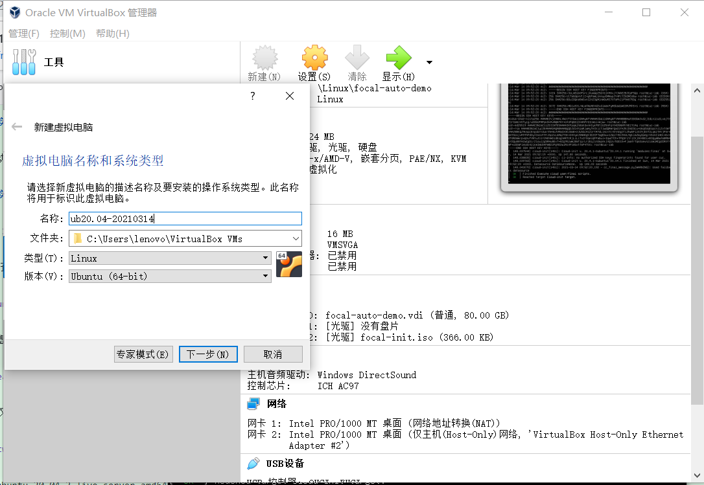
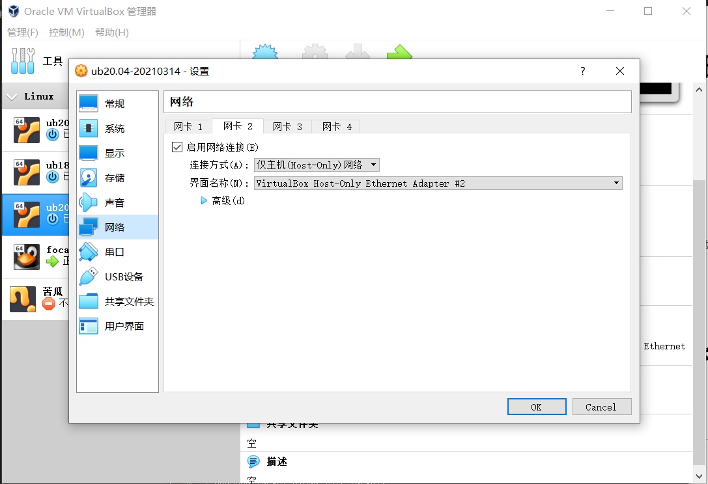
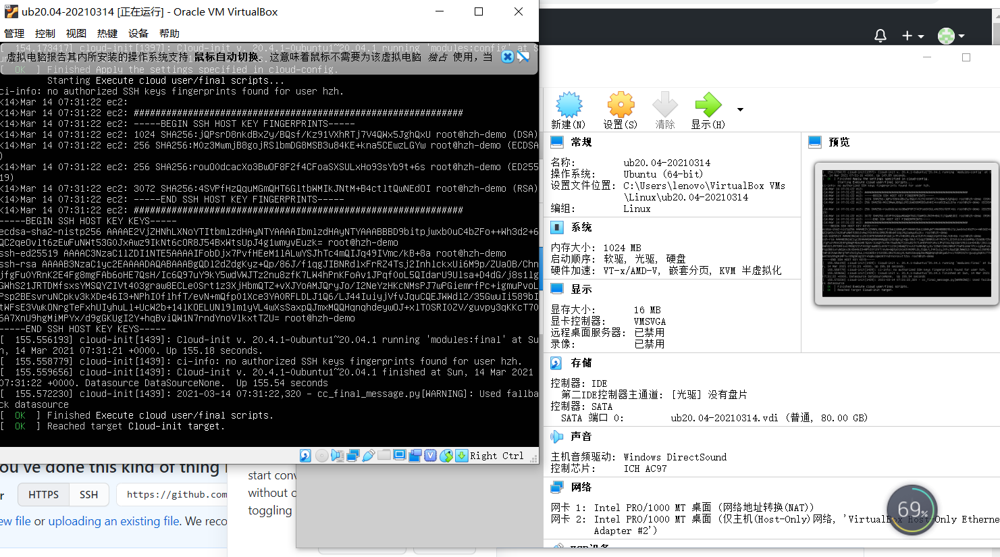
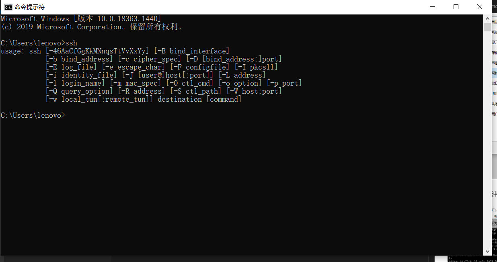
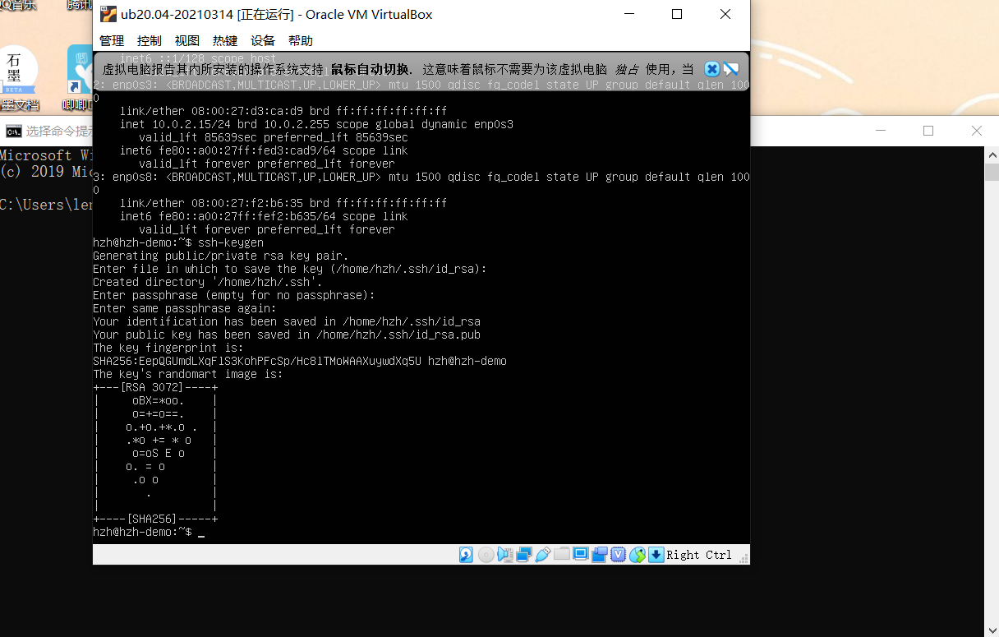
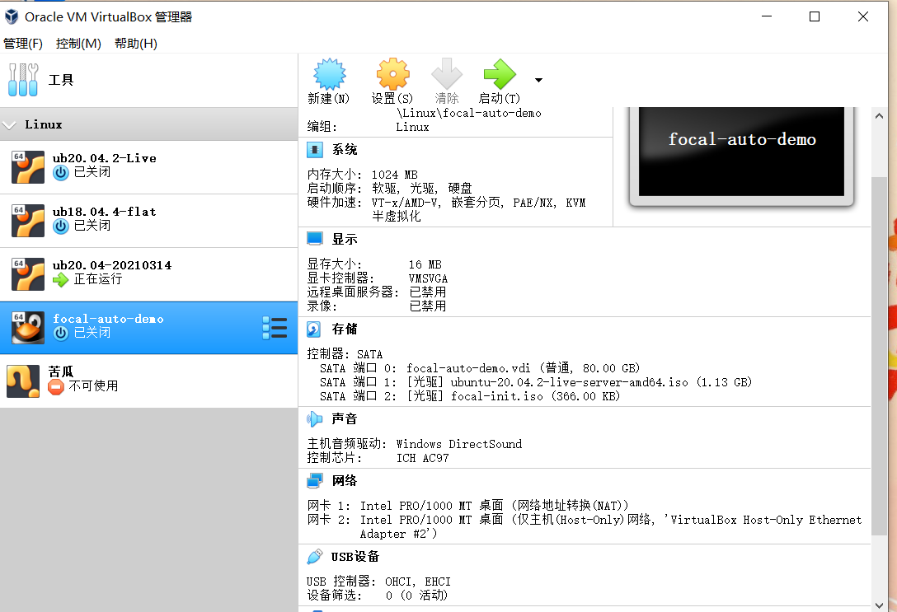
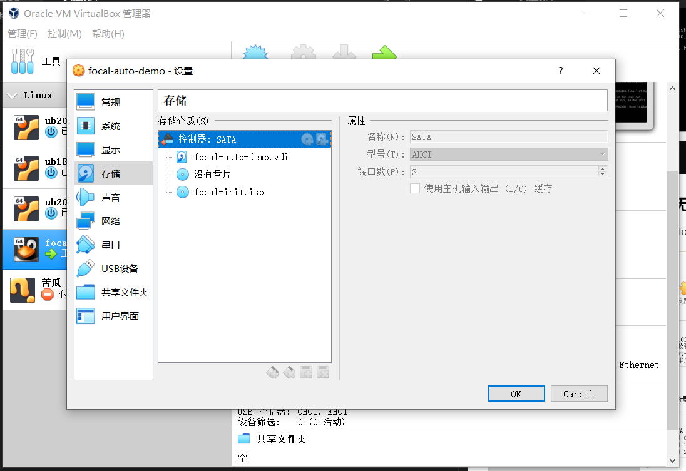
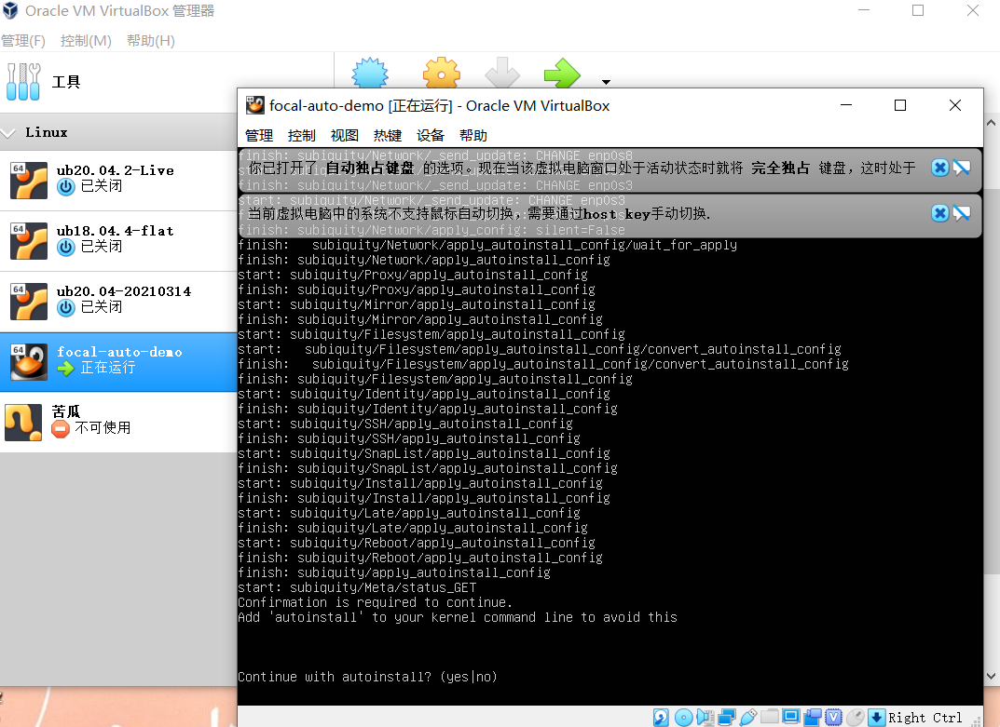
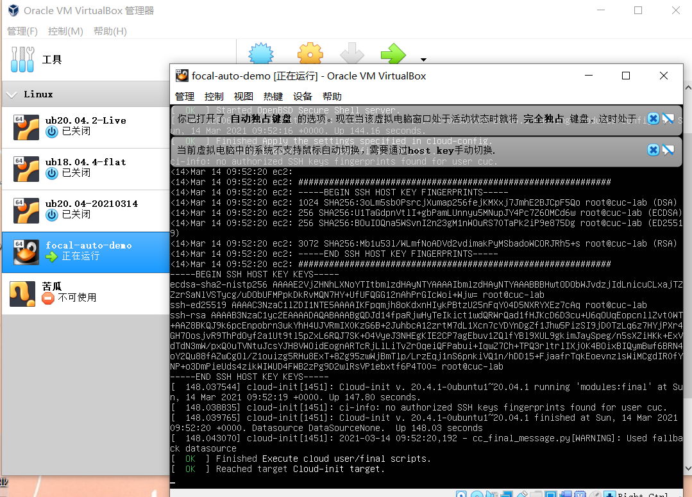

# Linux第一次实验报告

## 实验环境

Virtualbox
Ubuntu 20.04 Server 64bit

## 实验要求

配置无人值守安装iso并在Virtualbox中完成自动化安装

使用sftp在虚拟机和宿主机之间传输文件

## 实验步骤

### 1.下载Ubuntu安装镜像iso文件

### 2.手动安装Ubuntu

(1)新建虚拟机安装ubuntu

(2)设置双网卡，连接Host-only

(3)挂载Ubuntu纯净镜像iso文件，并成功安装

(4)在主机上安装openSSh server

*ssh虽配置成功，但无论如何也无法查询到新建虚拟机的IP地址，老师的方法已及百度出的相关解决方案暂时均无法查询到，所以没做到从主机命令行用ssh进入虚拟机.很遗憾没做到将得到的文件传入主机*

### 3.基于Ubuntu20.04系统的无人值守安装

(1)新建虚拟机进行无人值守安装并命名为focal-auto-demo

(2)移除新建虚拟机 设置-存储-控制器：IDE 并在控制器：SATA下载两个虚拟光盘，按顺序先挂载“纯净版Ubuntu安装镜像文件” 后挂载focal-int.iso(取自老师课件)

(3)启动虚拟机，在出现以下提示信息时输入yes

(4)回车后交给程序自动完成系统

## 实验问题及反思

(1)无法查询虚拟机IP地址，导致未能制作的镜像文件传入主机
   解决方案：百度查询，雨雀问答区
   现暂时并未解决
(2)挂载虚拟光盘是需先下载。