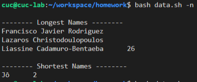

# 实验四：shell脚本编程练习基础

## 实验环境
- Ubuntu 20.04 Server 64bit
- PuTTY 64bit

## 编程任务

**任务一：用bash编写一个图片批处理脚本，实现以下功能：**

- [ ] 支持命令行参数方式使用不同功能
- [ ] 支持对指定目录下所有支持格式的图片文件进行批处理
- [ ] 支持以下常见图片批处理功能的单独使用或组合使用

- 支持对jpeg格式图片进行图片质量压缩
- 支持对jpeg/png/svg格式图片在保持原始宽高比的前提下压缩分辨率
- 支持对图片批量添加自定义文本水印
- 支持批量重命名（统一添加文件名前缀或后缀，不影响原始文件扩展名）
- 支持将png/svg图片统一转换为jpg格式图片
  
**任务二：用bash编写一个文本批处理脚本，对以下附件分别进行批量处理完成相应的数据统计任务：**

- [ ] [2014世界杯运动员数据](https://c4pr1c3.github.io/LinuxSysAdmin/exp/chap0x04/worldcupplayerinfo.tsv)
  
- 统计不同年龄区间范围（20岁以下、[20-30]、30岁以上）的球员数量、百分比
- 统计不同场上位置的球员数量、百分比
- 名字最长的球员是谁？名字最短的球员是谁？
- 年龄最大的球员是谁？年龄最小的球员是谁？
  
**任务三：用bash编写一个文本批处理脚本，对以下附件分别进行批量处理完成相应的数据统计任务：**
- [ ] [Web服务器访问日志](https://c4pr1c3.github.io/LinuxSysAdmin/exp/chap0x04/web_log.tsv.7z)
- 统计访问来源主机TOP 100和分别对应出现的总次数
- 统计访问来源主机TOP 100 IP和分别对应出现的总次数
- 统计最频繁被访问的URL TOP 100
- 统计不同响应状态码的出现次数和对应百分比
- 分别统计不同4XX状态码对应的TOP 10 URL和对应出现的总次数
- 给定URL输出TOP 100访问来源主机
  
## 实验步骤

**任务一**

``` 
# 对jpeg格式图片进行图片质量压缩
bash img.sh -d imgs/ -q 50%
```
```
# 对jpeg/png/svg格式图片在保持原始宽高比的前提下压缩分辨率
 bash img.sh -d imgs/ -r 90
 ```
 ```
 # 对图片批量添加自定义文本水印
 bash img.sh -d imgs/ -w "11"
 ```
 ```
# 批量重命名（统一添加文件名前缀或后缀，不影响原始文件扩展名）
 bash img.sh -d img/ -p "pre"
 bash img.sh -d img/ -s "tail"
 ```
 ```
 # 将png/svg图片统一转换为jpg格式图片
 bash img.sh -d img/ -c 100
 ```
 (处理后的图片见文件夹)

**任务二**
```
#统计不同年龄区间范围（20岁以下、[20-30]、30岁以上）的球员数量、百分比
 bash data.sh -ar
 ```
 

```
#统计不同场上位置的球员数量、百分比
 bash data.sh -p
```


```
 #统计名字最长，最短的球员
 bash data.sh -n
```


```
#统计年龄最大，最小的球员
 bash data.sh -ac
```


**任务三**

```
# 统计访问来源主机TOP 100和分别对应出现的总次数
 bash log.sh -o 100
```
```
# 统计访问来源主机TOP 100 IP和分别对应出现的总次数
 bash log.sh -i 100
```
```
# 统计最频繁被访问的URL TOP 100
 bash log.sh -u 100
```
```
# 统计不同响应状态码的出现次数和对应百分比
 bash log.sh -r
```
```
# 分别统计不同4XX状态码对应的TOP 10 URL和对应出现的总次数
 bash log.sh -u4 100
```
```
# 给定URL输出TOP 100访问来源主机,例给定URL"ksc.html"
 bash log.sh -uh  "ksc.html" 100
```

## 遇到问题及解决方法

1.虚拟机文件无法传送到主机，显示如下报错：


解决方法：
- [参考链接](https://blog.csdn.net/qq_38056704/article/details/93338172)
- 用vscode远程控制虚拟机，在文件栏里对想进行传输的文件夹直接右键下载
  
2.作业文件太大，无法提交至github

## 参考资料
- [运动员和weblog数据来源](https://c4pr1c3.github.io/LinuxSysAdmin/exp/chap0x04/web_log.tsv.7z)
- [linux-2020-cuc-Lynn](https://github.com/CUCCS/linux-2020-cuc-Lynn)
- [shell中文件后缀，目录等提取方法](https://blog.csdn.net/binggan_2019/article/details/89024460?ops_request_misc=&request_id=&biz_id=102&utm_medium=distribute.pc_search_result.none-task-blog-2~all~sobaiduweb~default-6)
  
  